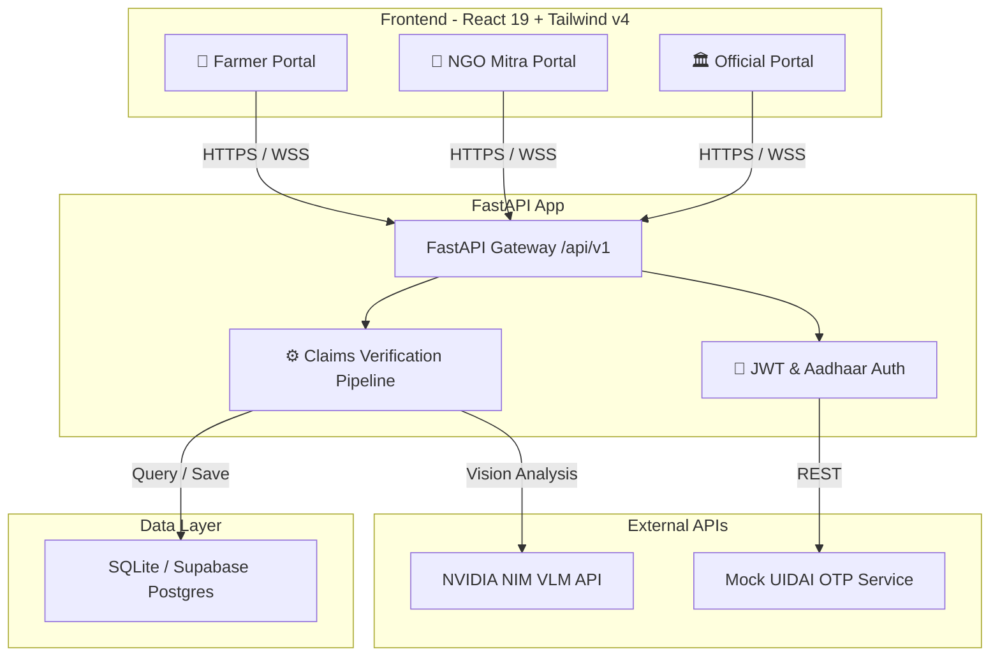

# 🌾 KRISHISEVA — AI-Powered Crop Insurance Claims Verification

[](https://fastapi.tiangolo.com)
[](https://react.dev)
[](https://supabase.com)
[](https://build.nvidia.com)
[](https://tailwindcss.com)

Welcome to **KRISHISEVA**, a state-of-the-art AI-Powered Crop Insurance Claims Verification platform designed for **The Blueprint Ideathon 2026 (Problem Statement 2)**. 

KRISHISEVA modernizes agricultural claim processing by replacing slow, manual, and fraud-prone inspections with an automated, multi-tiered verification pipeline. By integrating **AI Vision analysis**, **EXIF geotag validation**, **polygon land boundary matching**, and **multi-role verification**, the platform enables instant, transparent, and secure payouts for smallholder farmers. The MVP is scoped to a single-village deployment (**Wardha village, Maharashtra**).

---

## 🏗️ Project Architecture



---

## 🌟 Core Features & Modules

### ⚙️ Asynchronous Claims Verification Pipeline (VP)
When a farmer uploads a crop photo and files a claim, the system automatically triggers a 6-stage background verification pipeline:
1. **GPS Geotag Extraction**: Extracts and validates EXIF coordinate headers (`latitude`, `longitude`, and `timestamp`) from the uploaded photo to confirm it was taken at the field site during the event timeframe.
2. **AI Vision Analysis (NVIDIA NIM)**: The uploaded photo is analyzed using `meta/llama-4-maverick-17b-128e-instruct` via the **NVIDIA NIM API** to identify the crop type, detect the damage percentage, and provide a logical justification.
3. **GPS Boundary Scoring**: Cross-references the photo's GPS coordinates with the registered land parcel polygons in the Land Registry database, generating a distance match score.
4. **Crop Match Verification**: Verifies if the AI-identified crop matches the "Crop on Record" in the Land Registry for that survey number.
5. **Fraud Engine**: Automatically checks for duplicate claims on the same parcel, flags high-risk accounts, and checks against past payouts.
6. **Suggested Payout Engine**: Auto-calculates payout suggestions using:
   $$\text{Payout} = \min(\text{Damage \%} \times \text{Parcel Area} \times \text{Insured Sum Per Hectare}, \text{Maximum Cap})$$

### 👥 Three-Portal Ecosystem
* **🌾 Farmer Portal**: Passwordless login using Aadhaar e-KYC and OTP. View active land parcels, upload crop damage images, submit claims, and monitor claim tracking in real time.
* **🤝 NGO Mitra Portal**: Designed for trusted local field agents. Performs on-site crop assessments, captures field verification photos, and uploads official verification logs to build additional trust.
* **🏛️ Government Official (AO) Dashboard**: A comprehensive control panel for Agriculture Officers. Inspect detailed scoring breakdowns (AI damage %, GPS distance deviation, crop registry match, and fraud flags), review NGO field verification logs, adjust payout amounts, and finalize status approvals.

---

## 🔗 The Interconnected Demo Thread

To experience the entire, end-to-end claim lifecycle, the MVP features a pre-seeded, interconnected demo thread mapping **10 claims** across various stages of approval for farmer **Harish Patil** in Wardha village. 

You can log in to each portal with the following test credentials:

| Portal | Login Credential | Secret / Password | Role |
| :--- | :--- | :--- | :--- |
| **🌾 Farmer Portal** | Aadhaar: `999988887777` | OTP: `123456` | **Harish Patil** (Farmer) |
| **🤝 NGO Mitra Portal** | Email: `ngo.harish@example.com` | Password: `password123` | **Mitra NGO Agent** (Verifier) |
| **🏛️ Official Portal** | Email: `official.harish@gov.in` | Password: `password123` | **AO Harish Deshpande** (Official) |

### 📋 Pre-Seeded Claim Cases (10 Lifecycle Stages)
All 10 claims belong to **Harish Patil** and illustrate different system behaviors:
* **Claim 1 (Survey 301)**: `filed` — Submitted by farmer, awaiting review.
* **Claim 2 (Survey 302)**: `under_review` — AI evaluation complete, showing 65% damage.
* **Claim 3 (Survey 303)**: `verified` — NGO Mitra confirmed damage; awaiting official approval.
* **Claim 4 (Survey 304)**: `approved` — Approved by AO Harish Deshpande; ₹40,500 suggested.
* **Claim 5 (Survey 305)**: `payout_completed` — Payout of ₹108,000 cleared and settled.
* **Claim 6 (Survey 306)**: `denied` — Rejected by official due to GPS mismatch (out of boundary).
* **Claim 7 (Survey 307)**: `under_review` — AI model evaluating insect infestation.
* **Claim 8 (Survey 308)**: `verified` — NGO verified storm damage; awaiting official review.
* **Claim 9 (Survey 309)**: `approved` — Approved by AO for ₹67,200 payout.
* **Claim 10 (Survey 310)**: `payout_completed` — Payout of ₹56,000 for flood damage cleared.

---

## 🛠️ Project Structure
```
KRISHISEVA/
├── backend/            # FastAPI async web server
│   ├── app/            # Main application directory (routers, services, repos, models, schemas)
│   ├── seed/           # SQLite database seeding scripts
│   ├── tests/          # Pytest integration test suite
│   ├── .env.example    # Backend configuration template
│   └── requirements.txt
├── frontend/           # React 19 + Vite single-page application
│   ├── src/            # Components, pages, layouts, state services, and CSS
│   ├── .env.example    # Frontend environment config
│   └── package.json
└── mock-aadhaar/       # Mock UIDAI OTP Authentication service
    ├── static/         # Lookalike portals & control dashboards
    └── main.py         # Mock Aadhaar FastAPI backend
```

---

## ⚙️ Quick Start & Local Setup

Ensure you have **Python 3.12+** and **Node.js 18+** installed.

### 1. Launch Using Docker Compose (Recommended)
Docker Compose will spin up the PostgreSQL database, the FastAPI backend, and the Mock Aadhaar Service:
```bash
cd backend
# Copy env variables template and configure
copy .env.example .env
# Edit .env and supply your NVIDIA_API_KEY if testing live AI vision features.

docker-compose up --build
```

### 2. Manual Local Setup

#### Step A: Run the Mock Aadhaar Service
The mock UIDAI service runs on port `8001` to manage OTP challenges.
```bash
cd mock-aadhaar
python -m venv venv
venv\Scripts\activate      # On Windows
source venv/bin/activate    # On Unix/macOS
pip install fastapi uvicorn pydantic
uvicorn main:app --reload --port 8001
```
*Access the **UIDAI Impersonator UI** at `http://localhost:8001` and the **MockForge Controls** at `http://localhost:8001/mockforge`.*

#### Step B: Start the FastAPI Backend
```bash
cd backend
python -m venv venv
venv\Scripts\activate      # On Windows
source venv/bin/activate    # On Unix/macOS
pip install -r requirements.txt

# Seed the local SQLite database
python seed/seed_data.py

# Start the API server
uvicorn app.main:app --reload --port 8000
```
*Access the **OpenAPI Documentation** at `http://localhost:8000/docs`.*

#### Step C: Start the React Frontend
```bash
cd frontend
npm install
npm run dev
```
*Open [http://localhost:5173/](http://localhost:5173/) in your browser.*

---

## 🗄️ Database Configurations

### SQLite (Local Sandbox)
For local development speed, KRISHISEVA falls back to a SQLite database (`krishiseva.db`) when Postgres is not active. This sandbox is pre-populated with a test suite of farmers, land registries, crops, and claim records by running `python seed/seed_data.py`.

### Supabase Integration (Live Cloud)
KRISHISEVA has native support for live Supabase integration:
1. Log in to your [Supabase Console](https://supabase.com).
2. Open your project, navigate to the **SQL Editor**, and create a new query.
3. Paste the contents of `frontend/supabase_schema.sql` and run it. This creates the 12 primary tables, seeds the Wardha demographics, maps the 10 interconnected demo claims, and establishes permissive Row-Level Security (RLS) policies.
4. Set your Supabase endpoint and anon keys in `frontend/.env`:
   ```env
   VITE_SUPABASE_URL="https://your-project-id.supabase.co"
   VITE_SUPABASE_ANON_KEY="eyJhbGciOi..."
   ```

---

## 🧪 Testing & Linting

### Backend Tests
The backend has 100% coverage on critical authentication, claim verification pipelines, and dashboard endpoints.
```bash
cd backend
python -m pytest -v
```

### Frontend Linting
Clean rules and bundle size checks are enforced via Oxlint:
```bash
cd frontend
npm run lint
```

---

## 💡 Tech Stack Rationale
* **FastAPI (Python)**: Provides an asynchronous Gateway suitable for high-concurrency requests and fast streaming during VLM integration.
* **React 19 & Tailwind CSS v4**: Generates a responsive mobile-first UI with premium ag-tech aesthetics (glassmorphism panels, outfit-sans typography, custom SVG charts).
* **NVIDIA NIM API**: Provides high-throughput inference for AI vision capabilities with zero-setup model deployment.
* **Supabase**: Offers serverless auth logging, instantaneous JSON storage, and scalable PostgreSQL features for hackathon prototype deployment.

---
*Created for **The Blueprint Ideathon 2026**.*
